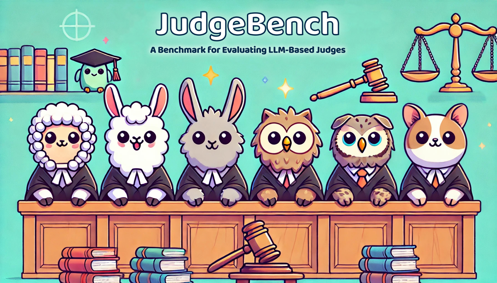

# JudgeBench: A Benchmark for Evaluating LLM-Based Judges



This repo contains source code for the paper: [JudgeBench: A Benchmark for Evaluating LLM-Based Judges](https://arxiv.org/abs/2410.12784).

<p align="center">
  📃 <a href="https://arxiv.org/abs/2410.12784" target="_blank">[Paper]</a> • 💻 <a href="https://github.com/ScalerLab/JudgeBench" target="_blank">[Github]</a> • 🤗 <a href="https://huggingface.co/datasets/ScalerLab/JudgeBench" target="_blank">[Dataset]</a> • 🏆 <a href="https://huggingface.co/spaces/ScalerLab/JudgeBench" target="_blank">[Leaderboard]</a>
</p>

### Installation
Set up a new environment and run `pip install -r requirements.txt`. This repository has been built and tested with Python 3.10.12.

### Data
The datasets are contained in `data/`, including 350 unique response pairs generated by GPT-4o and 270 unique response pairs generated by Claude-3.5-Sonnet. Each instance is a JSON object with the following format:
```json
{
    "pair_id": "81ec57f2-483f-515f-93ff-78a8910b2153",                      # unique identifier for response pair
    "original_id": "10646",                                                 # original question id in the source dataset
    "source": "mmlu-pro-computer science",                                  # source dataset for question
    "question": "Consider an additive white Gaussian noise channel ...",    # question to which responses are generated
    "response_model": "gpt-4o-2024-05-13",                                  # model used to generate the responses
    "response_A": "To determine the capacity of an additive white ...",     # one response candidate
    "response_B": "We are given an additive white Gaussian noise ...",      # another response candidate
    "label": "B>A"                                                          # objective label indicating correctness
}
```

### HuggingFace Dataset
Our dataset is also available on [HuggingFace](https://huggingface.co/datasets/ScalerLab/JudgeBench) and can be accessed using the Datasets library! The data on huggingface follows the same format outlined above. 
```python
from datasets import load_dataset
gpt_data = load_dataset("ScalerLab/JudgeBench", split="gpt")
claude_data = load_dataset("ScalerLab/JudgeBench", split="claude")
```

### Running a Judge on JudgeBench
The main functionality for running a judge on JudgeBench is located in `run_judge.py`. Additional utilities and helper functions are located under `utils/`. Currently, this repository supports several prompted judges and fine-tuned judges: [Vanilla](https://arxiv.org/abs/2305.14387), [Arena-Hard](https://arxiv.org/abs/2406.11939), [PandaLM](https://arxiv.org/abs/2306.05087), [Prometheus 2](https://arxiv.org/abs/2405.01535), [JudgeLM](https://arxiv.org/abs/2310.17631), [AutoJ](https://arxiv.org/abs/2310.05470), and [Skywork-Critic](https://huggingface.co/Skywork). We also support the following reward models: [InternLM2-7B-Reward](https://huggingface.co/internlm/internlm2-7b-reward), [InternLM2-20B-Reward](https://huggingface.co/internlm/internlm2-20b-reward), [GRM-Gemma-2B](https://huggingface.co/Ray2333/GRM-Gemma-2B-rewardmodel-ft), [Skywork-Reward-Gemma-2-27B](https://huggingface.co/Skywork/Skywork-Reward-Gemma-2-27B), and [Skywork-Reward-Llama-3.1-8B](https://huggingface.co/Skywork/Skywork-Reward-Llama-3.1-8B). As a simple example, to run the Arena-Hard Judge powered by GPT-4o-mini on the GPT-4o response pairs, run:
```
export OPENAI_API_KEY=your-api-key-here
python run_judge.py --judge_name arena_hard --judge_model gpt-4o-mini --pairs data/dataset=judgebench,response_model=gpt-4o-2024-05-13.jsonl
```

`run_judge.py` takes the following command line arguments:
| argument | description | required | options |
|----------|-------------|----------|---------|
| `--judge_name` | Name of judge. | Yes | `vanilla`, `arena_hard`, `panda_lm`, `prometheus_2`, `judge_lm`, `auto_j`, `skywork_critic`, `reward_model` | 
| `--judge_model` | Name of model to use with judge. | Yes | str (e.g., gpt-4o-mini, meta-llama/Llama-3.1-8B-Instruct) |
| `--single_game` | By default, we run each pair through twice with different response orderings. This flag will only run the original ordering, and should be used for judges that are order-independent (e.g., reward models). | No (default is False) | bool |
| `--seed` | Random seed to use for any random operations. | No (default is 42) | int | 
| `--concurrency_limit` | Asyncio can be used to generate judgments concurrently. This argument sets an upper limit on the number of pairs judgments are generated for at any given time. | No (default is 1) | int | 
| `--pairs` | Path to dataset. This does not necessarily need to be a JudgeBench dataset, as long as it adheres to the format outlined above. | Yes | str |

Our codebase support models hosted by OpenAI, Anthropic, Together, and Google Cloud's VertexAI. Simply export an appropriate API key as shown below. For VertexAI, see the authorization instructions in `utils/models.py`. 
```
export OPENAI_API_KEY=your-openai-api-key         # (GPT-4o, GPT-4o-mini, o1-preview, o1-mini, etc.)
export ANTHROPIC_API_KEY=your-anthropic-api-key   # (Claude-3.5-Sonnet, Claude-3-Haiku, etc.)
export TOGETHER_API_KEY=your-together-api-key     # (Llama-3.1-405B-Instruct, etc.)
```
Then run `run_judge.py`. For example:
```
python run_judge.py --judge_name arena_hard --judge_model gpt-4o-mini --pairs data/dataset=judgebench,response_model=gpt-4o-2024-05-13.jsonl
```
This will print out an evaluation report, and save an output file under `outputs/` containing the judgments for each pair. 

Additionally, we also support models served via a locally-running vLLM OpenAI compatible server. See [vLLM's official documentation](https://docs.vllm.ai/en/latest/) for more information. To serve a model locally on a machine with enough GPU compute, run:
```
docker run --runtime nvidia --gpus all \
    -v ~/.cache/huggingface:/root/.cache/huggingface \
    --env "HF_TOKEN=<your-huggingface-token>" \
    -p 8000:8000 \
    --ipc=host \
    vllm/vllm-openai:latest \
    --model Skywork/Skywork-Critic-Llama-3.1-8B
```
Then, from either the same machine (or a different computer connected to the machine serving the model via an ssh tunnel over port 8000), run `run_judge.py` as normal. For example:
```
python run_judge.py --judge_name skywork_critic --judge_model Skywork/Skywork-Critic-Llama-3.1-8B --pairs data/dataset=judgebench,response_model=gpt-4o-2024-05-13.jsonl
```

Similarly, we support running reward models locally, but only on machines with enough GPU compute (ssh tunnelling is not an option here). To install the additional libraries required to do so, run `pip install -r requirements-cuda.txt` into an environment. Then to run a reward model on JudgeBench, run:
```
python run_judge.py --judge_name reward_model --judge_model Skywork/Skywork-Reward-Llama-3.1-8B --single_game --pairs data/dataset=judgebench,response_model=gpt-4o-2024-05-13.jsonl
```
Note that all the reward models we have implemented share a `judge_name` of `reward_model`, while the `judge_model` is the identifier on HuggingFace. Also, reward models can be run with the `--single_game` flag to save computation, since reward models assign a score to each model independently.


### Running a new Judge on JudgeBench
Start by creating a new judge class in `utils/judges.py` that inherits from the abstract class Judge.
```python
class Judge(ABC):
    @abstractmethod
    async def get_judgment(self, question: str, answer_A: str, answer_B: str) -> Dict[str, Any]:
        pass
```
The only required method for a judge is `get_judgment()`, which takes in a single question and two ordered candidate responses (`response_A` and `response_B`) and returns a dictionary containing the key `decision` indicating the verdict (e.g., A>B or B>A). For convenience, we often return other items (e.g., input prompt, generated judgement) under the `judgment` key. Moreover, we tend to use the judge's `__init__()` method to initialize the api client, and a helper method or two to abstract away some implementation details (e.g., parsing the decision from the judgment). For example implementations, see `utils/judges.py`

Prompts for judges can be stored under `utils/templates/` in jinja format, then formatted directly from `get_judgment()` using the jinja file's name. For example,
```python
formatted_prompt = prompts.render_template("arena_hard_judge_prompt", prompt=question, answer_a=answer_A, answer_b=answer_B)
```

Lastly, add an entry for your new judge to `get_judge_from_judge_name_and_model` in `utils/judges.py`. For example:
```python
def get_judge_from_judge_name_and_model(judge_name: str, judge_model: str) -> Judge:
    if judge_name == "arena_hard":
        return ArenaHard(judge_model)
    elif judge_name == "my-new-judge":
        return MyNewJudge(judge_model)
    else:
        raise NotImplementedError(f"Judge with name {judge_name} is not yet implemented.")
```

### Questions, Comments, Concerns?
Please open an issue here on GitHub! If you'd like us to add your Judge's results to [the JudgeBench leaderboard](https://huggingface.co/spaces/ScalerLab/JudgeBench), please make a PR with your judge's implementation and open an issue referencing your PR. If you get stuck, we'd be glad to try and assist!

### Citation
If you find JudgeBench useful or relevant to your work, please kindly cite our paper:
```bibtex
@misc{judgebench2024,
  title={JudgeBench: A Benchmark for Evaluating LLM-Based Judges},
  author={Sijun Tan and Siyuan Zhuang and Kyle Montgomery and Willian Y. Tang and Alejandro Cuadron and Chenguang Wang and Raluca Ada Popa and Ion Stoica},
  year={2024},
  archivePrefix={arXiv},
  url={https://arxiv.org/abs/2410.12784}
}
```
